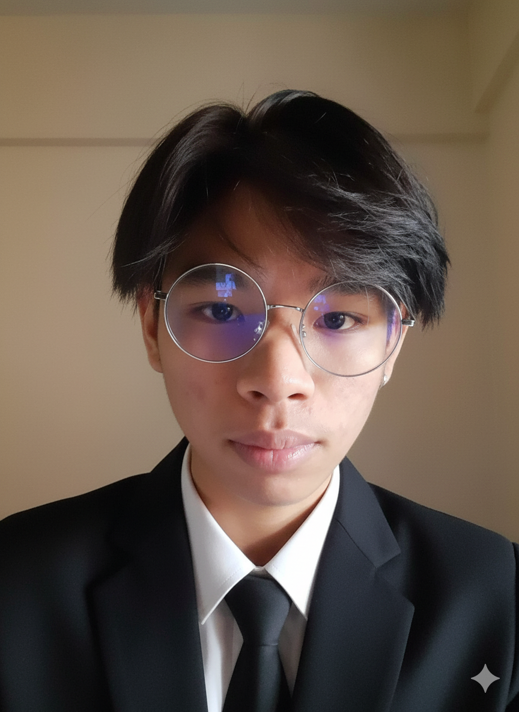

<!-- Banner / Cover -->

  

<h1 align="center">Hi, I’m Worawiboon K </h1>

  <strong>Backend Developer • API Builder • Problem Solver</strong> 
  <em>“Engineering the core behind the code.”</em>

---

## 🚀 About Me
- 🌱  I’m currently learning : Spring MVC , JSP , CSS , JavaScript  
- 🛠  Tools: Eclipse · VS Code · GitHub  
- 🎯  2025 Goal: Master Spring Boot & Microservices for scalable backend systems  
- 📫  Reach me: fevboily@gmail.com

---

## 🧰 Tech Stack & Tools

  

---

## 📌 Featured Projects
| Project | Tech | Highlights |
|---------|------|-----------|
| BookShop | Spring MVC · JSP · MySQL | Design your own screen |

---

## ✍🏻 Languages
-English (Fair)
-Thai (Good)

---

## 📈 Skills

  Hard skills
  -Robot framework
  -Github
  -Microsoft Office
  Soft skills
  -Problem solving
  -Communication
  -Adaptability

---

## 🤝 Connect

- 💌 Email : fevboily@gmail.com  
- 📝 Line ID : woraviboon123  
- 🐦 DM me on : 

  

